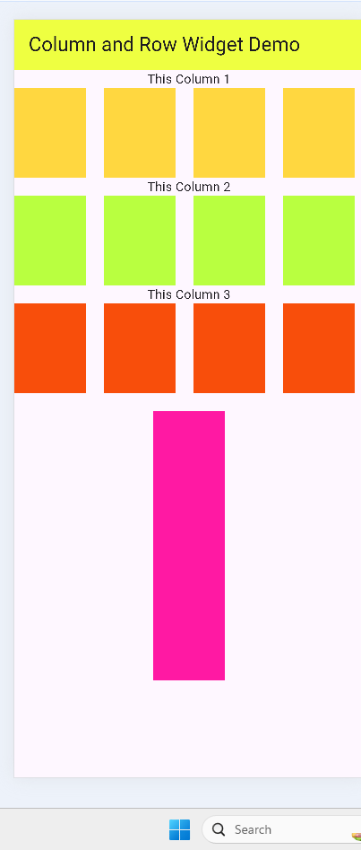

# Flutter Row & Column Demo

A simple Flutter project demonstrating the use of **Row** and **Column** widgets to build UI layouts.

## 📱 Screenshot



## 🚀 Features

* Vertical layout using Column
* Horizontal layout using Row
* Spacing using SizedBox
* Multiple containers with different colors
* Nested layouts

## 🛠️ Tech Stack

* Flutter
* Dart

## 📚 Learning Outcomes

* Difference between Row and Column
* mainAxisAlignment vs crossAxisAlignment
* How to manage spacing between widgets
* Handling layout overflow

## ▶️ Run Locally

```bash
flutter pub get
flutter run
```

## 📌 Note

This project is created to practice Flutter layout concepts and improve UI design skills.
